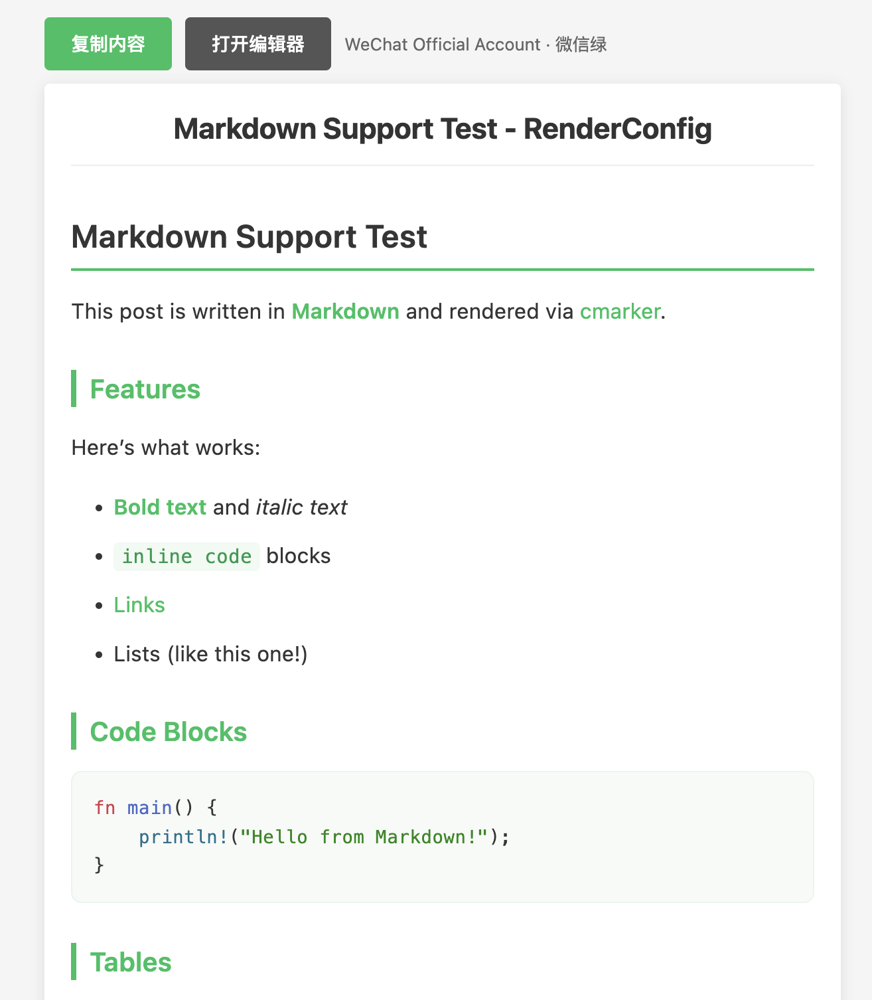
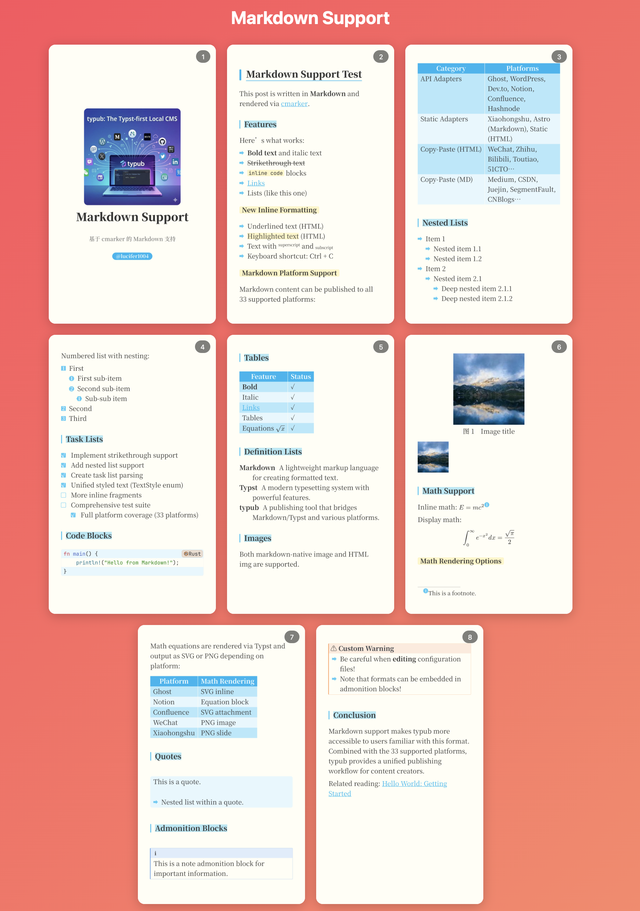

# typub

<p align="center">
  <a href="https://github.com/lucifer1004/typub/actions/workflows/ci.yml"></a>
  <a href="https://codecov.io/gh/lucifer1004/typub"></a>
  <a href="https://crates.io/crates/typub"></a>
  <a href="https://opensource.org/licenses/MIT"></a>
  <a href="https://github.com/govctl-org/govctl"></a>
</p>

**English** | [中文](./README_CN.md)

typub is a Typst-first, multi-platform publishing tool.

## User Basics

### Prerequisites

**Important:** typub depends on [typst CLI](https://github.com/typst/typst). You must have `typst` installed and available in your PATH.

Install typst CLI:

```bash
# Via cargo
cargo install typst

# Or via other package managers (see https://github.com/typst/typst for more options)
```

### Install

```bash
cargo install typub
```

### Minimal flow

```bash
typub init
typub new "My Post"
typub dev posts/my-post -p ghost
typub publish posts/my-post -p ghost
```

## Key Features

### 🎯 Typst-first with Markdown-compatibility

Write content in Typst (`content.typ`) or Markdown (`content.md`). Typst is the primary format with powerful typesetting capabilities, while Markdown provides a familiar alternative. Both formats can be published to any supported platform.

### 🌐 Multiple-platform Compatibility

Publish to multiple platforms from a single content source:

- **API-based**: Dev.to, Ghost, HashNode, Confluence, Notion, WordPress
- **Copy-paste (HTML)**: WeChat, Zhihu, Toutiao, Bilibili, Weibo, Baijiahao, Wangyihao, Sohu, Sspai, OSChina
- **Copy-paste (Markdown)**: CSDN, Juejin, SegmentFault, Cnblogs, Medium, Jianshu, InfoQ, 51CTO, TencentCloud, Aliyun, HuaweiCloud, Elecfans, ModelScope, Volcengine
- **Local output**: Astro, Static, Xiaohongshu

### 👀 Dev Preview

Preview your content locally before publishing:

- **Live reload**: Auto-refresh on save with built-in dev server (`typub dev`)
- **Platform-specific preview**: See exactly how content renders on each platform
- **Theme support**: Choose from built-in themes (github, notion, minimal, tech, etc.) or create custom ones
- **Math rendering**: MathJax-powered LaTeX rendering

```bash
# Preview with auto-reload
typub dev posts/my-post -p ghost

# Preview for different platforms
typub dev posts/my-post -p confluence
```

Themes are configured in `meta.toml` or `typub.toml`, not via command-line arguments.

### 🖥️ Terminal User Interface (TUI)

Interactive terminal dashboard for content management:

- **Post management**: Browse, sort, and manage all your posts
- **Platform overview**: See publishing status across all platforms at a glance
- **Preview content**: Preview posts in terminal or browser for selected platform
- **Publish control**: Selectively publish to individual platforms or all at once
- **Real-time progress**: Track publishing progress and results

```bash
# Launch interactive TUI dashboard
typub tui
```

### 📦 4 Asset Strategies

Choose how images and other assets are handled:

- **embed**: Base64 encode inline — small images, no upload dependency
- **upload**: Upload to platform storage — platforms with native media APIs
- **copy**: Copy to local output — local/static outputs
- **external**: Upload to S3-compatible host — CDN, large assets, cross-platform URLs

### 📐 3 Math Rendering Strategies

Render mathematical expressions based on platform capabilities:

- **SVG**: Platform supports inline SVG — use Typst's native SVG rendering (default)
- **LaTeX**: Platform requires LaTeX math macros — preserve original LaTeX source
- **PNG**: Platform supports base64 images but not SVG — rasterize to PNG via resvg

### ⚙️ Layered Config System

Manage configuration with 5-level resolution priority (highest to lowest):

1. **Post-platform**: Per-content platform-specific (`meta.toml` → `[platforms.<id>]`)
2. **Post**: Per-content default (`meta.toml` → top level)
3. **Global-platform**: Global platform-specific (`typub.toml` → `[platforms.<id>]`)
4. **Global**: Global default (`typub.toml` → top level)
5. Adapter default (fallback)

---

## Showcases

### Preview Examples






---

## Documentation Map

### For users (publishing content)

- Basic path: `docs/guide/getting-started.md`
- Platform setup: `docs/guide/adapters.md`
- Assets: `docs/guide/assets.md`
- Copy-paste profiles: `docs/guide/profiles.md`
- Advanced customization: `docs/guide/advanced-customization.md`

### For developers (contributing to typub)

- Development workflow: `DEVELOPING_GUIDE.md`
- Agent/contributor guardrails: `CLAUDE.md`
- Specifications and architecture: `docs/rfc/` and `docs/adr/`

## User Advanced Features

- Per-platform asset strategy (`embed` / `upload` / `copy` / `external`)
- External storage integration for cross-platform asset URLs
- Copy-paste profile selection and customization
- Node policy override (`raw` / `unknown`) via platform config

See `docs/guide/advanced-customization.md` for a platform-agnostic overview.

## License

MIT
