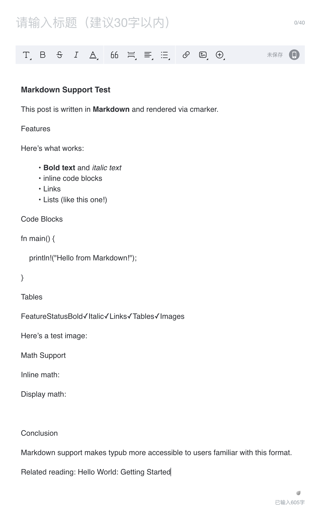

# 哔哩哔哩专栏

哔哩哔哩（B站）是国内领先的弹幕视频网站，同时提供专栏功能发布图文内容。

## 平台能力

| 特性     | 支持情况       |
| -------- | -------------- |
| 输出格式 | HTML（富文本） |
| 代码高亮 | 不支持         |
| 资源策略 | 不支持         |
| 数学公式 | 不支持         |
| 图片上传 | 需手动         |

## 使用方法

哔哩哔哩专栏使用复制粘贴工作流：

```bash
# 预览内容
typub dev posts/my-post -p bilibili
```

1. 浏览器打开预览页面
2. 点击 **复制内容** 按钮
3. 打开 [哔哩哔哩专栏](https://member.bilibili.com/platform/article/text/new)
4. 粘贴内容到编辑器



## 平台限制

B站专栏编辑器功能较为基础，仅支持基本格式，发布前请检查：

### 格式支持

- **支持**：标题、段落、加粗、斜体、列表
- **不支持**：代码高亮、代码块、数学公式、表格、图片上传
- **代码处理**：代码块会被渲染为普通文本，无语法高亮
- **图片处理**：不支持粘贴或上传图片，需要手动在编辑器中添加

### 链接

- 支持插入链接，但需要手动在编辑器中添加
- 粘贴的链接可能被转为纯文本

## 平台注意事项

- **内容审核**：文章发布需要通过平台审核
- **字数要求**：专栏文章有最低字数要求
- **排版建议**：B 站用户偏好图文并茂、轻松活泼的内容
- **封面图**：需单独设置，建议尺寸 1146x717
- **图片限制**：正文不支持图片，如有图片需求请考虑其他平台

## 提示

- 标题建议吸引眼球，符合 B 站社区风格
- 代码内容建议截图后作为图片插入
- 可添加视频链接与文章联动
- 如需大量配图，建议考虑其他平台

## 发布流程

1. 复制粘贴内容后，检查格式
2. **检查代码块**：确认代码显示是否正确（无高亮）
3. 设置专栏封面图
4. 选择文章分类
5. 点击发布，等待审核
