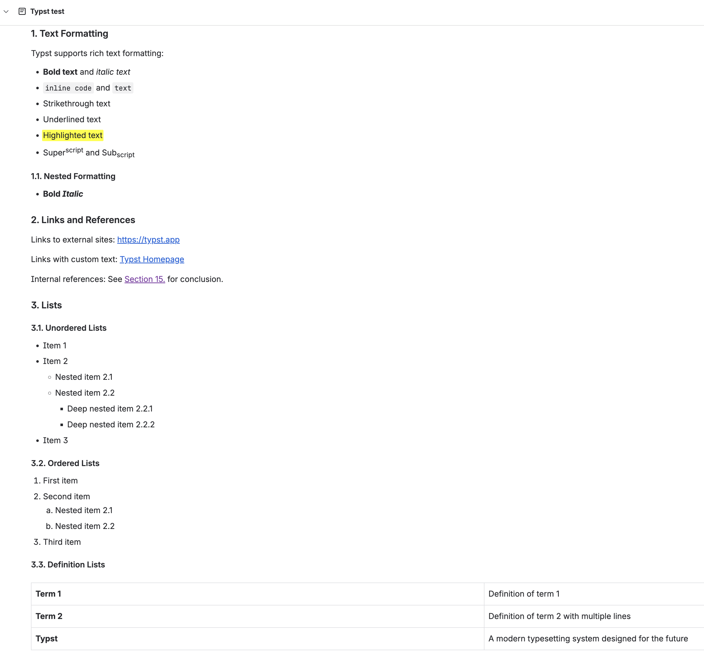

# Confluence

Confluence is Atlassian's enterprise wiki and documentation platform. typub supports publishing to Confluence Cloud via the REST API with Basic authentication.

## Capabilities

| Feature        | Support                                         |
| -------------- | ----------------------------------------------- |
| Tags           | Yes (maps to labels)                            |
| Categories     | No                                              |
| Internal Links | Yes                                             |
| Draft Support  | Reversible (status field: `current` vs `draft`) |
| Math Rendering | LaTeX (via ADF extension) or PNG (attachments)  |
| Local Output   | No                                              |

### Asset Strategies

| Strategy   | Supported | Default | Notes                      |
| ---------- | --------- | ------- | -------------------------- |
| `upload`   | Yes       | \*      | Upload as page attachments |
| `embed`    | No        |         | Not supported              |
| `external` | No        |         | Not supported              |
| `copy`     | No        |         | Not supported              |

## Prerequisites

- Confluence Cloud instance (Server/Data Center may work but is not tested)
- Personal Access Token or API token for authentication
- (Optional) LaTeX Math plugin for formula rendering

## Authentication

Confluence Cloud uses Basic authentication with your email and an API token.

### Step 1: Create an API Token

1. Go to [Atlassian Account Settings](https://id.atlassian.com/manage-profile/security/api-tokens)
2. Click **Create API token**
3. Give it a label (e.g., "typub")
4. Copy the generated token

### Step 2: Configure typub

```toml
[platforms.confluence]
base_url = "https://your-company.atlassian.net"  # Your Confluence URL
default_space = "DOCS"                            # Default space key
email = "you@example.com"                         # Your email (or use CONFLUENCE_EMAIL env var)
api_key = "your-api-token"                        # API token (or use CONFLUENCE_API_KEY env var)
```

**Environment Variables**:

```bash
export CONFLUENCE_EMAIL="you@example.com"
export CONFLUENCE_API_KEY="your-api-token"
```

> **Security Warning**: Never commit API tokens to version control. Use environment variables instead.

## LaTeX Math Rendering

Confluence supports two math rendering strategies:

### Option 1: LaTeX via ADF Extension (Recommended)

Uses the Appfire LaTeX Math plugin with Atlassian Document Format (ADF) extensions. This provides native LaTeX rendering without image attachments.

**Prerequisites**:

1. Install the [LaTeX Math for Confluence](https://marketplace.atlassian.com/apps/1215211/latex-math-for-confluence) app from Atlassian Marketplace
2. Get the App ID and Environment ID from the app configuration

**Configuration**:

```toml
[platforms.confluence]
math_rendering = "latex"           # Use LaTeX rendering
latex_math_app_id = "your-app-id"  # From Appfire app configuration
latex_math_env_id = "your-env-id"  # From Appfire app configuration
```

To find your App ID and Environment ID:

1. In Confluence, use the LaTeX Math macro in a page
2. Open the browser's developer tools (F12) → Network tab
3. Insert a LaTeX formula and look for API calls
4. The App ID and Environment ID appear in the request URLs

Alternatively, contact your Confluence administrator or check the app's configuration in **Settings → Apps → Manage apps**.

> **Note**: When the app ID and env ID are not provided, the LaTeX rendering backend would fall back to use the traditional ac macros, which are going to be deprecated and may not work as expected.

### Option 2: PNG Attachments

Render math formulas as PNG images and attach them to the page. This works without any plugins but produces image-based formulas.

```toml
[platforms.confluence]
math_rendering = "png"
```

Generated PNG files are stored in your content's `assets/` folder and uploaded as attachments.

## Usage

```bash
# Preview content
typub dev posts/my-post -p confluence

# Publish to Confluence
typub publish posts/my-post -p confluence
```



## Post Configuration

### Space Selection

Specify which Confluence space to publish to:

```toml
# In your post's meta.toml
[platforms.confluence]
space = "ENG"  # Override default space
parent_id = "123456"  # Optional: parent page ID for hierarchical structure
```

> **Note**: `parent_id` only applies when **creating new pages**. If the page already exists, updating content will not change its parent location. This prevents accidental page moves during content updates.

### Labels (Tags)

Tags are automatically synced as Confluence labels:

```toml
# In your post's meta.toml
tags = ["rust", "tutorial", "api"]
```

Label normalization rules:

- Converted to lowercase
- Special characters replaced with hyphens
- Maximum 255 characters
- Duplicates removed

### Draft Mode

Confluence supports draft mode via the `published` field:

```toml
[platforms.confluence]
published = false  # Creates/updates as draft
```

- `published = true`: Page status is `current` (visible to readers)
- `published = false`: Page status is `draft` (hidden from readers)

You can toggle this at any time.

## Asset Handling

All images are uploaded as page attachments. The adapter uses Confluence's attachment API with deduplication:

1. Images are uploaded with their original filename
2. If an attachment with the same name exists, it's replaced
3. Image references in content are resolved to attachment URLs

### Image Caption and Alt Mapping

- For a single-image `figure`, typub maps `figcaption` to Confluence `<ac:caption>` on `<ac:image>`
- Image `alt` is mapped to `ac:alt` (accessibility/metadata), not visible caption
- If no `figcaption` exists, typub does not promote `alt` into `<ac:caption>`

### Supported Image Formats

- PNG, JPEG, GIF, WebP
- SVG (extracted and converted to inline elements)

### Code Blocks

Confluence uses CDATA for code block content. Complex highlighting may not be preserved. For best results:

- Use standard Markdown code blocks
- Language identifiers are preserved where possible
- Consider using Confluence's built-in code block macro for advanced features

## Internal Links

Internal links between your posts are resolved using Confluence's link format:

```markdown
[Related Post](../other-post/index.typ)
```

The adapter resolves the target post's Confluence page ID and creates appropriate links.

## Troubleshooting

### "CONFLUENCE_API_KEY not set"

- Ensure the environment variable is set or `api_key` is configured in `profiles.toml`
- Verify your shell profile exports the variable correctly

### "latex_math_app_id not configured"

- Set `latex_math_app_id` and `latex_math_env_id` in your platform configuration
- Or switch to `math_rendering = "png"` for PNG-based math

### "Confluence create page error (400)"

- Check that the space key is correct (case-sensitive)
- Verify you have permission to create pages in the specified space
- Ensure required fields (title, space) are properly set

### "Confluence attachment upload error (403)"

- Verify you have attachment upload permissions
- Check that the page exists before uploading attachments
- Ensure the API token is not expired

### Labels not syncing

- Labels require Edit permission on the page
- Invalid characters in labels are automatically replaced
- Check Confluence's audit logs for rejection details

### Math not rendering

- For LaTeX mode: Verify the LaTeX Math plugin is installed and activated
- Check that `latex_math_app_id` and `latex_math_env_id` are correct
- For PNG mode: Ensure PNG generation is working (check `assets/` folder)

### Page not found after changing slug

- typub uses the cached page ID for updates
- If you changed the title/slug, the adapter falls back to title search
- For manual control, set the page ID in status database
