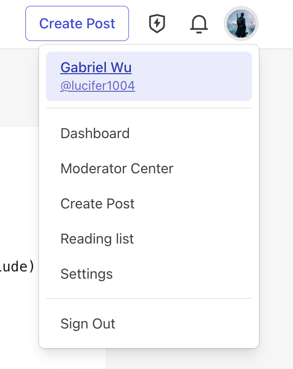
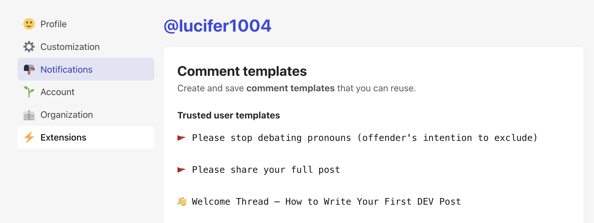
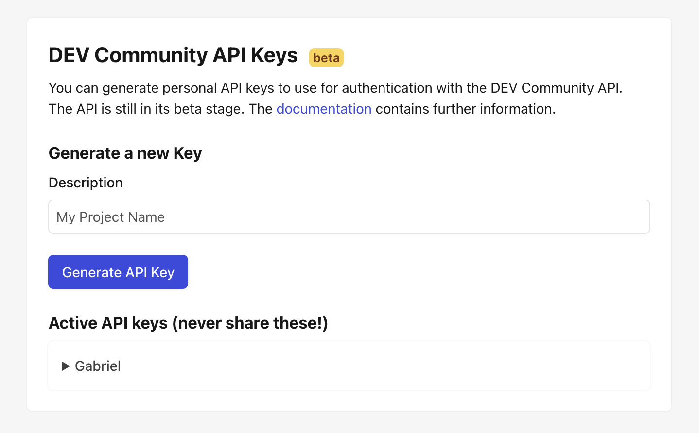
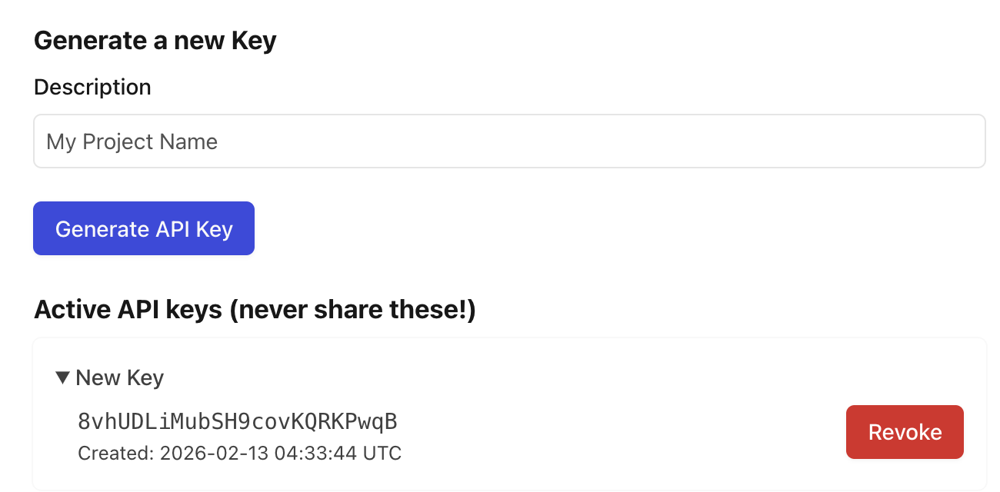

# Dev.to

Dev.to is a community of software developers sharing ideas and helping each other grow.

## Capabilities

| Feature        | Support                   |
| -------------- | ------------------------- |
| Tags           | Yes (max 4)               |
| Categories     | No                        |
| Internal Links | Yes                       |
| Draft Support  | Reversible (status field) |
| Math Rendering | PNG                       |
| Local Output   | No                        |

### Asset Strategies

| Strategy   | Supported | Default |
| ---------- | --------- | ------- |
| `embed`    | Yes       |         |
| `upload`   | No        |         |
| `external` | Yes       | \*      |
| `copy`     | No        |         |

> **Note**: Dev.to has limited support for embedded Base64 images.

## Prerequisites

- A Dev.to account (free)

## Getting Your API Key

### Step 1: Sign In to Dev.to

Go to [dev.to](https://dev.to) and sign in to your account.

### Step 2: Access Settings

1. Click your profile picture in the top-right corner
2. Select **Settings** from the dropdown menu



### Step 3: Navigate to Extensions

1. In the left sidebar, click **Extensions**
2. Scroll down to find **DEV Community API Keys**



### Step 4: Generate API Key

1. Enter a description (e.g., "typub")
2. Click **Generate API Key**



3. The key will appear under **Active API keys** — expand it to copy



> **Security Warning**:
>
> - **Never commit API keys to version control** — use environment variables instead.
> - If you suspect your key has been compromised, revoke it immediately and generate a new one.

## Configuration

```toml
[platforms.devto]
api_base = "https://dev.to/api"  # optional, this is the default
published = true                  # true for published, false for draft
asset_strategy = "embed"          # or "external"
```

**Environment Variables**:

Set `DEVTO_API_KEY` with your API key:

```bash
export DEVTO_API_KEY="your-api-key-here"
```

## Usage

```bash
# Preview content
typub dev posts/my-post -p devto

# Publish to Dev.to
typub publish posts/my-post -p devto
```

## Tag Limits

Dev.to allows a maximum of 4 tags per article. If your content has more than 4 tags, typub will use the first 4.

```toml
# In your post's meta.toml
tags = ["rust", "webdev", "tutorial", "beginners"]  # All 4 will be used
```

## Troubleshooting

### "Unauthorized" error

- Verify your API key is correct
- Check that the key hasn't been revoked in Dev.to settings
- Ensure `DEVTO_API_KEY` environment variable is set

### Article not appearing

- Check if `published = false` in your config (creates draft)
- Draft articles are only visible to you in the Dev.to dashboard

### Images not loading

- Dev.to requires images to be accessible via public URLs
- Use `asset_strategy = "external"` with S3/R2 storage for reliable image hosting
- Embedded base64 images may hit size limits for large images
