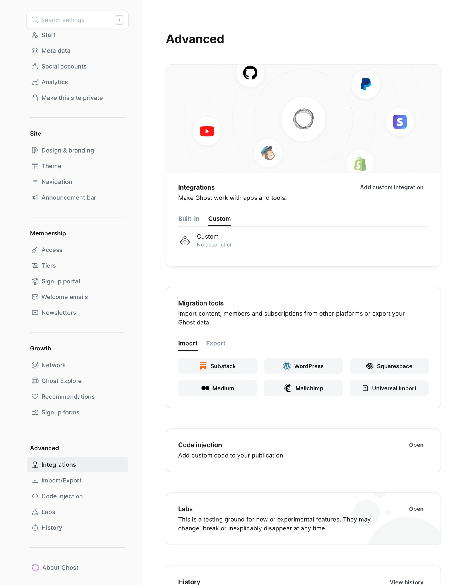
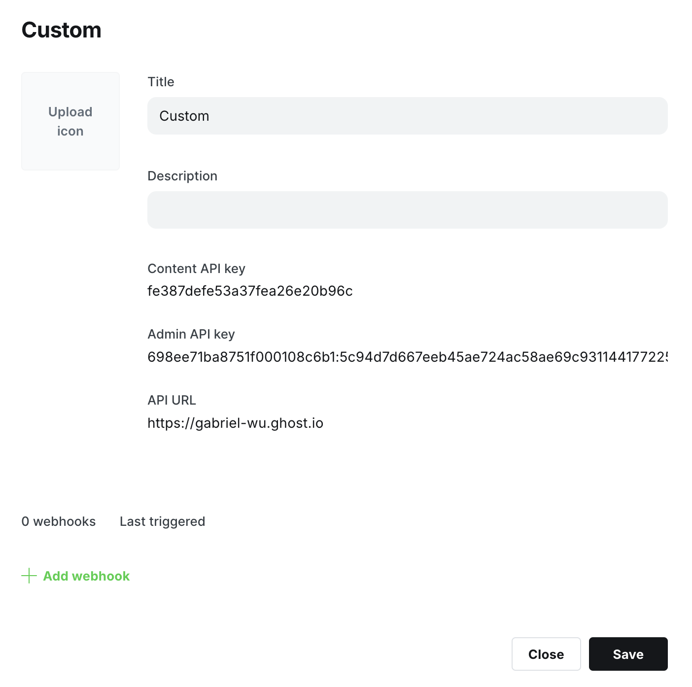

# Ghost

Ghost is an open-source, professional publishing platform built on Node.js.

## Capabilities

| Feature        | Support                   |
| -------------- | ------------------------- |
| Tags           | Yes                       |
| Categories     | No                        |
| Internal Links | Yes                       |
| Draft Support  | Reversible (status field) |
| Math Rendering | SVG                       |
| Local Output   | No                        |

### Asset Strategies

| Strategy   | Supported | Default | Notes                               |
| ---------- | --------- | ------- | ----------------------------------- |
| `embed`    | Yes       | \*      | Images embedded as data URIs        |
| `upload`   | Yes       |         | Upload to Ghost's image storage     |
| `external` | Yes       |         | Upload to S3/R2, use external URLs  |
| `copy`     | No        |         | Ghost cannot fetch local file paths |

## Prerequisites

- A Ghost site (self-hosted or Ghost(Pro))
- Admin access to create integrations

## Getting Your API Key

Ghost uses Admin API keys for authentication. The key format is `id:secret` where both parts are hex strings.

### Step 1: Access Ghost Admin

Navigate to your Ghost admin panel at `https://your-site.com/ghost/`.

### Step 2: Open Integrations

1. Click the **Settings** gear icon in the bottom-left corner
2. Select **Integrations** from the menu



### Step 3: Create Custom Integration

1. Scroll down to **Custom integrations**
2. Click **Add custom integration**
3. Enter a name (e.g., "typub")
4. Click **Create**

### Step 4: Copy Admin API Key

1. In the integration details, locate **Admin API Key**
2. Click the key to reveal it
3. Copy the entire key (format: `abc123:def456...`)



> **Important**: The Admin API Key has full write access. Keep it secure and never commit it to version control.

## Configuration

```toml
[platforms.ghost]
api_base = "https://your-site.com"  # Your Ghost site URL
published = true                     # true for published, false for draft
asset_strategy = "embed"             # or "upload", "external"
```

**Environment Variables**:

Set `GHOST_ADMIN_API_KEY` with your Admin API key:

```bash
export GHOST_ADMIN_API_KEY="your-id:your-secret"
```

Or in your shell profile:

```bash
# ~/.bashrc or ~/.zshrc
export GHOST_ADMIN_API_KEY="abc123def456:789xyz..."
```

## Usage

```bash
# Preview content
typub dev posts/my-post -p ghost

# Publish to Ghost
typub publish posts/my-post -p ghost
```

## Troubleshooting

### "Invalid API key" error

- Ensure the key format is `id:secret` (two hex strings separated by colon)
- Verify the key hasn't been regenerated in Ghost Admin
- Check that `api_base` doesn't include `/ghost/api/` suffix

### "Unauthorized" error

- Confirm the integration is still active in Ghost Admin
- Try regenerating the API key and updating your environment variable

### Images not appearing

- For self-hosted Ghost, ensure your site URL is publicly accessible
- Try using `asset_strategy = "upload"` to upload images directly to Ghost
