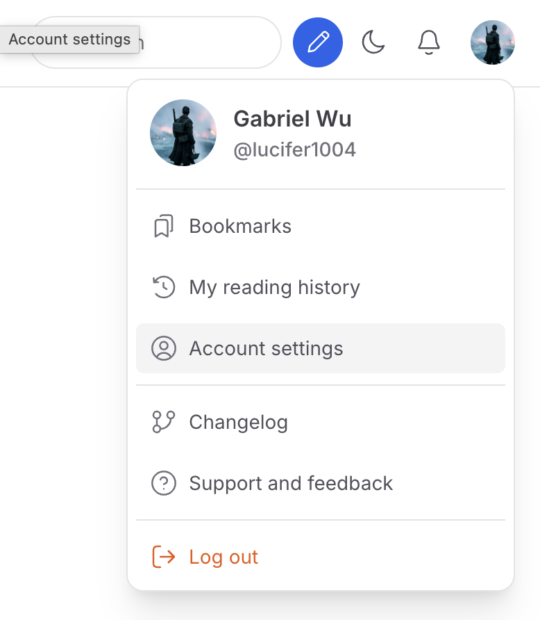
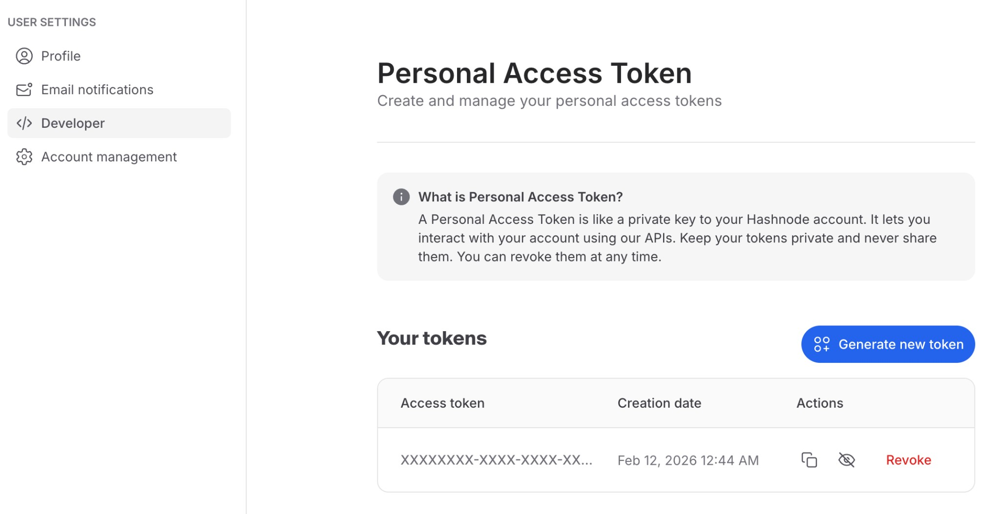
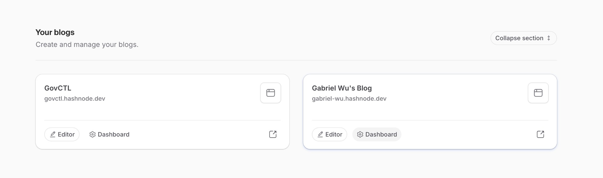
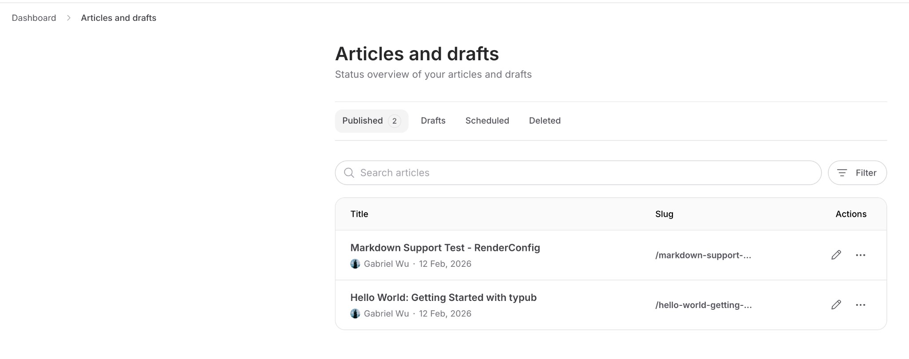

# Hashnode

Hashnode is a blogging platform for developers with built-in features like custom domains, newsletters, and analytics.

## Capabilities

| Feature        | Support                      |
| -------------- | ---------------------------- |
| Tags           | Yes (max 5)                  |
| Categories     | No                           |
| Internal Links | Yes                          |
| Draft Support  | Yes (separate draft objects) |
| Math Rendering | LaTeX (MathJax)              |
| Local Output   | No                           |

### Asset Strategies

| Strategy   | Supported | Default |
| ---------- | --------- | ------- |
| `embed`    | No        |         |
| `upload`   | No        |         |
| `external` | Yes       | \*      |
| `copy`     | No        |         |

## Prerequisites

- A Hashnode account (free)
- A Hashnode publication (blog)

## Getting Your API Token

### Step 1: Access Developer Settings

1. Sign in to [hashnode.com](https://hashnode.com)
2. Click your profile picture → **Account Settings**



### Step 2: Generate Personal Access Token

1. In the left sidebar, click **Developer**
2. Click **Generate new token**
3. Copy the token from the table (use the copy button)



> **Security Warning**:
>
> - **Never commit tokens to version control** — use environment variables instead.
> - If you suspect your token has been compromised, click **Revoke** and generate a new one.

### Step 3: Find Your Publication

1. Go to your Hashnode homepage
2. Find **Your blogs** section



### Step 4: Get Publication ID

1. Click **Dashboard** on your blog
2. The Publication ID is in the URL: `https://hashnode.com/{publication-id}/dashboard`



## Configuration

```toml
[platforms.hashnode]
publication_id = "your-publication-id"  # Publication ID from step 4
asset_strategy = "external"             # Only external URLs supported
```

**Environment Variables**:

Set `HASHNODE_API_TOKEN` with your personal access token:

```bash
export HASHNODE_API_TOKEN="your-token-here"
```

## Usage

```bash
# Preview content
typub dev posts/my-post -p hashnode

# Publish to Hashnode
typub publish posts/my-post -p hashnode
```

## Tag Limits

Hashnode allows a maximum of 5 tags per article. If your content has more than 5 tags, typub will use the first 5.

```toml
# In your post's meta.toml
tags = ["rust", "webdev", "tutorial", "beginners", "programming"]  # All 5 will be used
```

## Troubleshooting

### "Unauthorized" error

- Verify your API token is correct
- Check that the token hasn't expired or been revoked
- Ensure `HASHNODE_API_TOKEN` environment variable is set

### Article not appearing

- Check if `published = false` in your configuration
- Draft articles are only visible in your Hashnode dashboard
- Verify the publication ID is correct

### Images not loading

- Hashnode only supports external image URLs
- Configure S3/R2 storage and use `asset_strategy = "external"` (default)
- Images must be publicly accessible via URL
