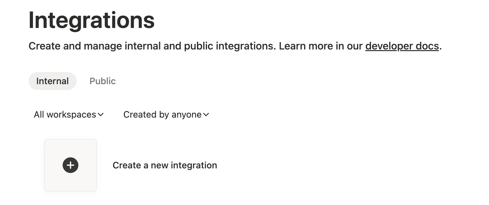
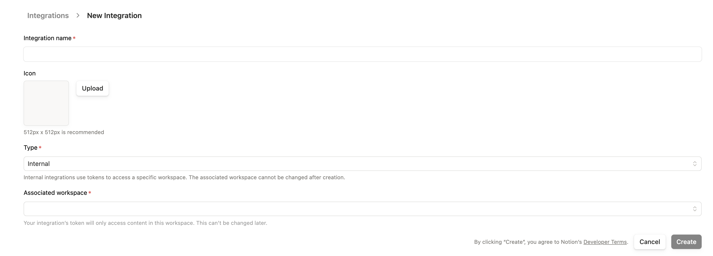
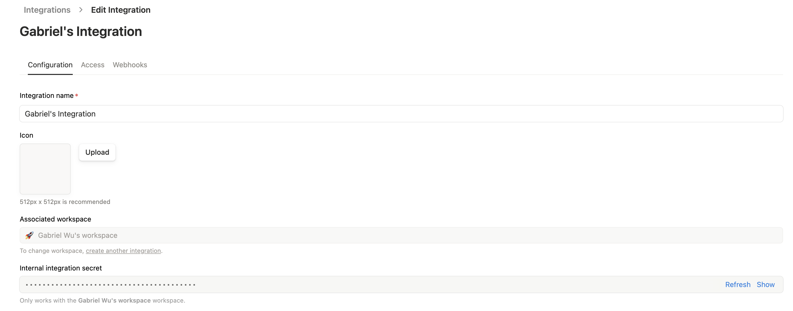
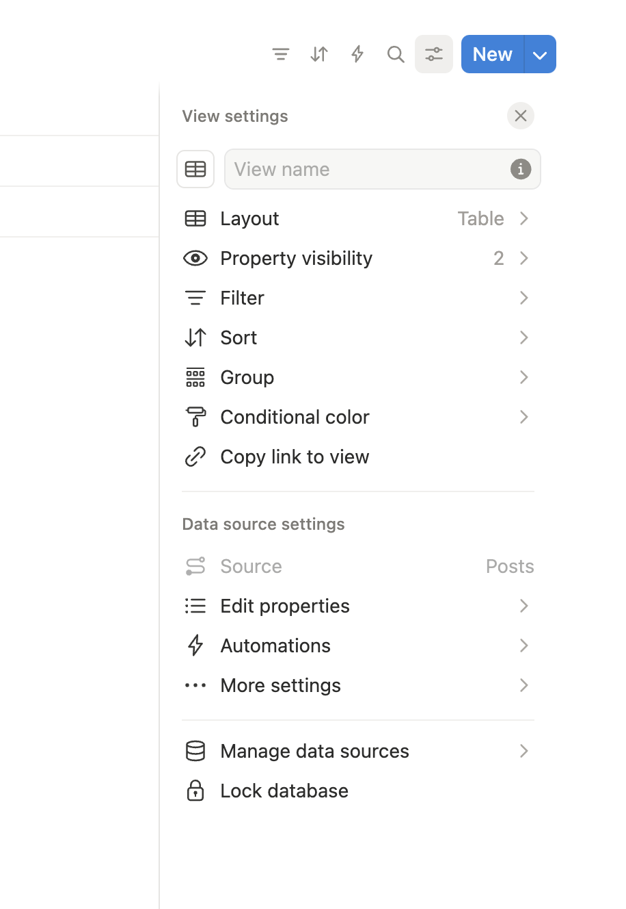
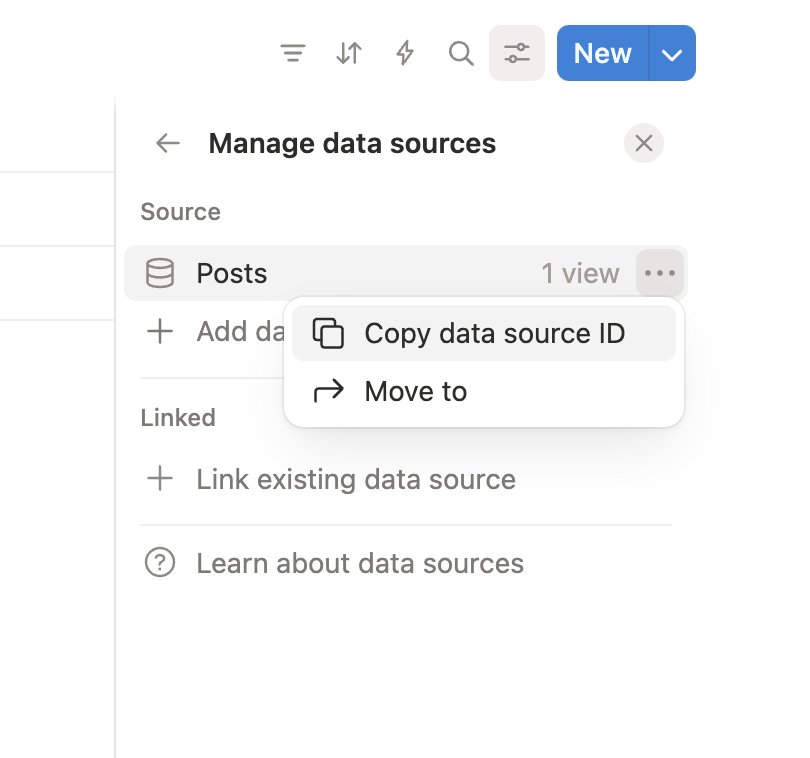
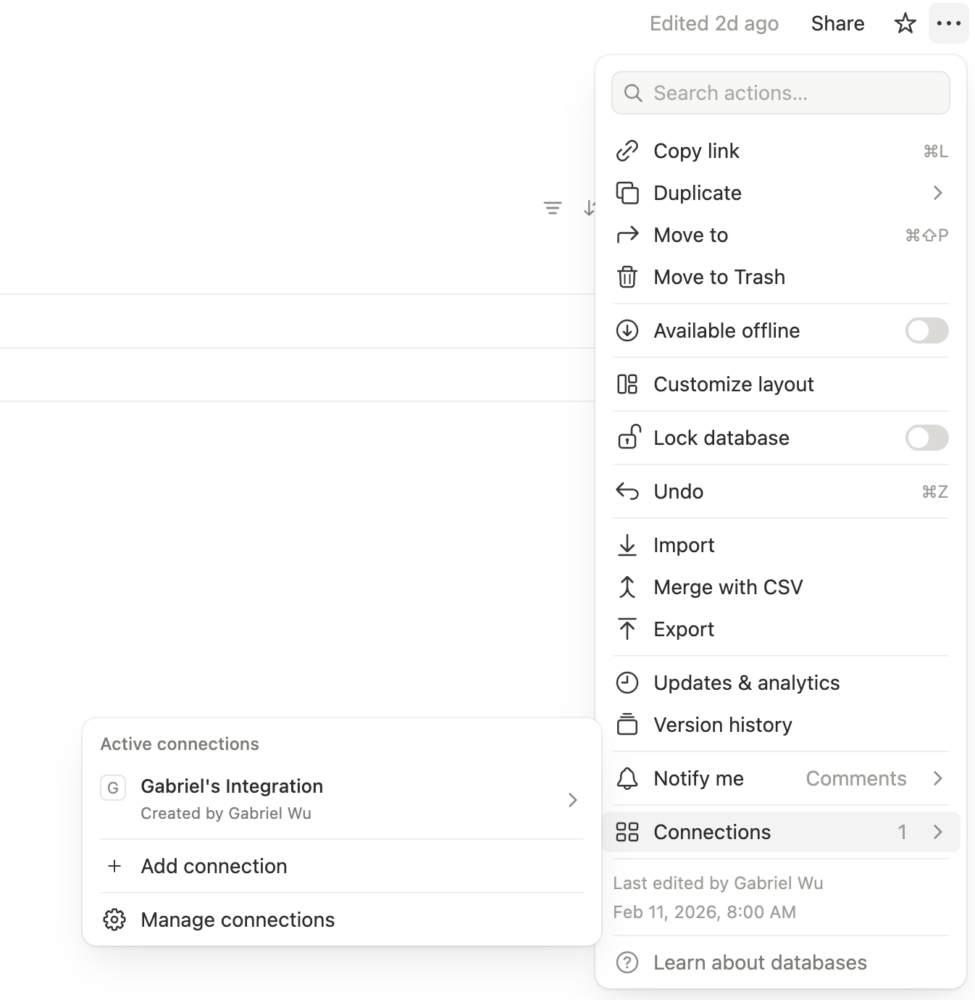

# Notion

Notion is an all-in-one workspace for notes, docs, and project management.

## Capabilities

| Feature        | Support                         |
| -------------- | ------------------------------- |
| Tags           | Yes (via multi-select property) |
| Categories     | No                              |
| Internal Links | Yes                             |
| Draft Support  | None                            |
| Math Rendering | LaTeX                           |
| Local Output   | No                              |

### Asset Strategies

| Strategy   | Supported | Default |
| ---------- | --------- | ------- |
| `embed`    | No        |         |
| `upload`   | Yes       | \*      |
| `external` | Yes       |         |
| `copy`     | No        |         |

## Prerequisites

- A Notion account (free or paid)
- A database to publish content to

## Getting Your API Token

Notion uses Internal Integrations for API access.

### Step 1: Create Integration

1. Go to [notion.so/my-integrations](https://www.notion.so/my-integrations)
2. Click **+ New integration**



### Step 2: Configure Integration

1. Enter a name (e.g., "typub")
2. Select the workspace to associate with
3. Keep **Internal integration** selected
4. Click **Submit**



### Step 3: Copy Secret Token

1. On the integration page, find **Internal Integration Secret**
2. Click **Show** then **Copy**



> **Important**: This token has access to pages you explicitly share with it. Keep it secure.

### Step 4: Get Data Source ID

1. Open your target database in Notion
2. Click **...** (View settings) → **Manage data sources**



3. Click **...** next to the data source → **Copy data source ID**



### Step 5: Connect Integration to Database

1. Open the database page
2. Click **...** (more) → **Connections**
3. Click **+ Add connection** and select your integration



## Configuration

```toml
[platforms.notion]
data_source_id = "your-database-id"  # Database ID from step 4
tags_property = "Tags"                # Name of multi-select property for tags
asset_strategy = "upload"             # or "external"
```

**Environment Variables**:

Set `NOTION_API_KEY` with your integration secret:

```bash
export NOTION_API_KEY="secret_abc123..."
```

## Usage

```bash
# Preview content
typub dev posts/my-post -p notion

# Publish to Notion
typub publish posts/my-post -p notion
```

## Database Setup

Your Notion database should have these properties:

| Property | Type         | Required | Notes                            |
| -------- | ------------ | -------- | -------------------------------- |
| Title    | Title        | Yes      | Page title (default Name column) |
| Tags     | Multi-select | No       | For tag sync                     |

Additional properties can be added but won't be synced by typub.

## Image Captions and Alt Text

Notion image blocks use `caption` for visible image text.

- If the source contains `figcaption`, typub writes it to Notion `image.caption` (highest priority)
- If there is no `figcaption`, typub falls back to image `alt` and writes it to `image.caption`
- typub does not send `image.alt` in API payloads

This behavior matches the current Notion API validation for image blocks.

## Troubleshooting

### "Unauthorized" error

- Verify your `NOTION_API_KEY` is correct
- Ensure the integration is connected to the target database (Step 5)
- Check that the database ID is correct (no `?v=` suffix)

### Tags not syncing

- Verify `tags_property` matches the exact property name in Notion
- The property must be of type "Multi-select"
- Tags are created automatically if they don't exist

### Images not appearing

- Notion requires images to be uploaded or have public URLs
- Use `asset_strategy = "upload"` (default) or `asset_strategy = "external"`
- Embedded base64 images are not supported

### `validation_error` mentions `image.alt should be not present`

- This means the request body included an unsupported `image.alt` field
- typub now maps visible caption text to `image.caption` only
