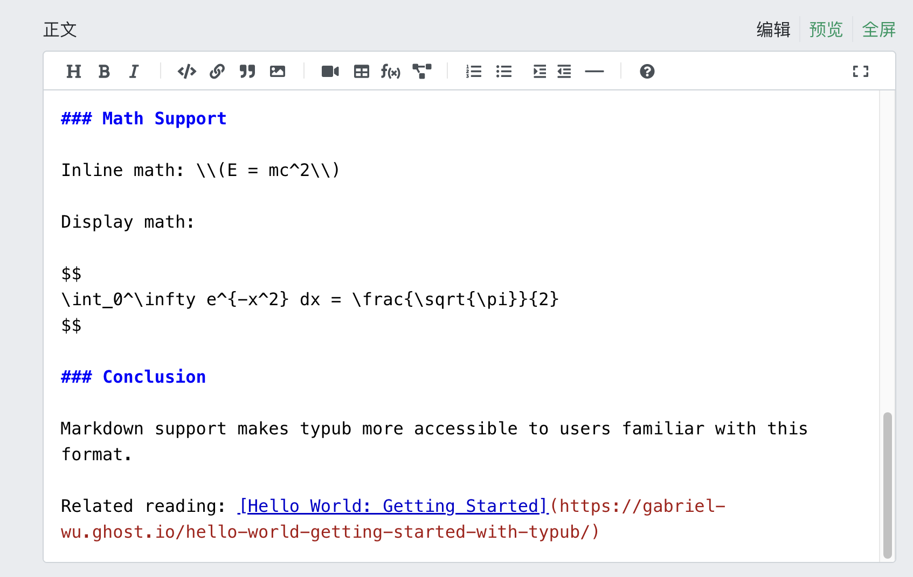
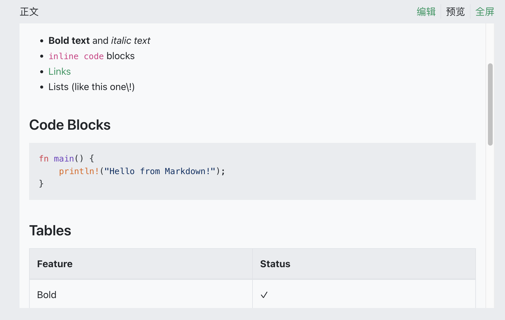

# SegmentFault 思否

SegmentFault（思否）是中文技术问答社区和博客平台，支持Markdown格式。

## 平台能力

| 特性       | 支持情况                       |
| ---------- | ------------------------------ |
| 输出格式   | Markdown                       |
| 资源策略   | external（外链）               |
| 数学分隔符 | `\(...\)` 行内，`$$...$$` 块级 |
| 代码高亮   | 平台内置                       |

### 资源策略

| 策略       | 支持 | 默认 | 说明             |
| ---------- | ---- | ---- | ---------------- |
| `embed`    | 否   |      | 不支持Base64图片 |
| `external` | 是   | \*   | 使用S3/R2外链    |

## 使用方法

```bash
# 预览内容
typub dev posts/my-post -p segmentfault
```

1. 浏览器打开预览页面
2. 点击 **复制内容** 按钮
3. 打开 [思否写文章](https://segmentfault.com/write)
4. 粘贴内容



## 渲染结果示例



## 数学公式分隔符

SegmentFault使用特殊的数学分隔符组合：

- **行内公式**：`\(...\)`
- **块级公式**：`$$...$$`

typub会自动进行处理。

## 配置示例

```toml
[storage]
type = "s3"
endpoint = "https://your-r2-endpoint.r2.cloudflarestorage.com"
bucket = "your-bucket"
region = "auto"
url_prefix = "https://cdn.your-domain.com"

[platforms.segmentfault]
asset_strategy = "external"
```

## 提示

- 思否的阅读体验偏向技术文章
- 文章可关联到问答问题
- 支持设置专栏收录
- 图片必须使用外部链接
