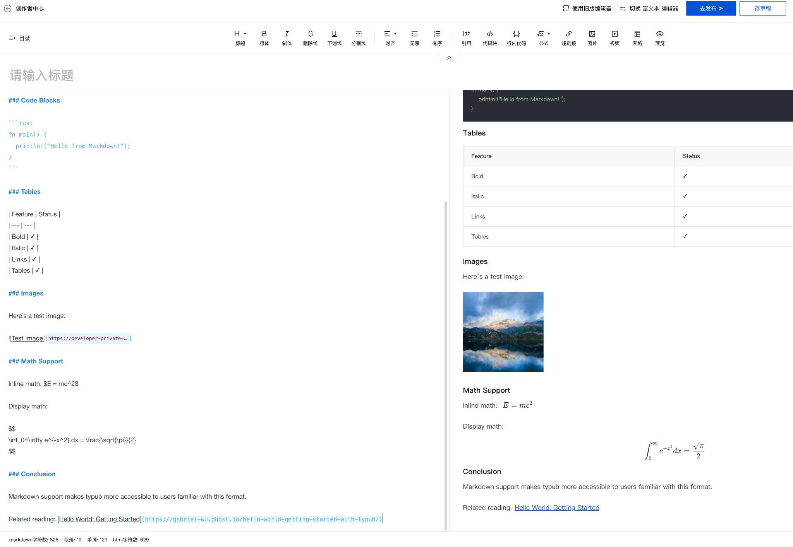

# 腾讯云开发者社区

腾讯云开发者社区是腾讯云官方的技术内容平台，支持 Markdown 格式发布文章。

## 平台能力

| 特性     | 支持情况          |
| -------- | ----------------- |
| 输出格式 | Markdown          |
| 默认主题 | 无（纯 Markdown） |
| 特殊转换 | 无                |

### 资源策略

| 策略                   | 支持 | 默认 |
| ---------------------- | ---- | ---- |
| `embed`（Base64 内嵌） | 是   | \*   |
| `external`（外部存储） | 是   |      |

## 平台限制/注意事项

- **Markdown 语法**：支持标准 Markdown，包括 GFM 扩展
- **图片**：支持外链图片，建议使用腾讯云 COS 或可靠 CDN
- **代码块**：支持语法高亮
- **数学公式**：支持 LaTeX 语法（`$...$` 和 `$$...$$`）
- **表格**：支持 GFM 表格语法

## 发布流程

### 1. 预览内容

```bash
typub dev posts/my-post -p tencentcloud
```

浏览器会打开预览页面，显示生成的 Markdown 内容。

### 2. 复制内容

点击预览页面的 **复制内容** 按钮，将 Markdown 文本复制到剪贴板。

### 3. 打开编辑器

访问 [腾讯云开发者社区写作中心](https://cloud.tencent.com/developer/article/write-new)。


### 4. 粘贴内容

1. 点击右上角 **切换 MD 编辑器** 进入 Markdown 模式
2. 在左侧编辑区域粘贴 Markdown 内容
3. 右侧会实时预览渲染效果



### 5. 处理图片

**方式一：使用 Base64 内嵌（推荐）**

腾讯云 Markdown 编辑器支持 Base64 内嵌图片，使用默认的 `asset_strategy = "embed"` 即可，无需额外处理。

**方式二：使用外链**

如果使用 `asset_strategy = "external"`，图片 URL 会直接嵌入 Markdown 中，无需额外处理。

**方式三：上传到腾讯云**

1. 点击编辑器工具栏的 **图片** 按钮
2. 选择本地上传或使用腾讯云 COS
3. 替换 Markdown 中的图片链接

### 6. 发布

1. 填写标题
2. 选择文章分类和标签
3. 点击 **去发布** 或 **存草稿**

## 配置选项

```toml
[platforms.tencentcloud]
# asset_strategy = "embed"  # 默认，使用 Base64 内嵌图片
```

## Markdown 特性支持

| 特性     | 支持 | 说明               |
| -------- | ---- | ------------------ |
| 标题     | ✅   | `#` ~ `######`     |
| 列表     | ✅   | 有序、无序、嵌套   |
| 代码块   | ✅   | 支持语法高亮       |
| 表格     | ✅   | GFM 格式           |
| 引用     | ✅   | `>` 语法           |
| 链接     | ✅   | 外链、内部链接     |
| 图片     | ✅   | Base64、外链或上传 |
| 数学公式 | ✅   | LaTeX 语法         |
| 任务列表 | ✅   | `- [ ]` / `- [x]`  |
| 脚注     | ❌   | 不支持             |

## 常见问题

### Q: 代码块没有语法高亮？

A: 确保代码块指定了语言标识：

````markdown
```python
print("hello")
```
````

### Q: 图片无法显示？

A: 腾讯云支持 Base64 内嵌图片，默认配置即可正常显示。如果使用外链图片，检查 URL 是否可访问。

### Q: 数学公式渲染异常？

A: 腾讯云使用 KaTeX 渲染公式。某些 LaTeX 命令可能不支持。常见问题：

- 避免使用 `\begin{align}` 等复杂环境
- 使用 `\displaystyle` 替代 `\dfrac`

### Q: 表格显示不正确？

A: 确保表格使用标准 GFM 格式，且有表头分隔行：

```markdown
| 列1 | 列2 |
| --- | --- |
| A   | B   |
```
