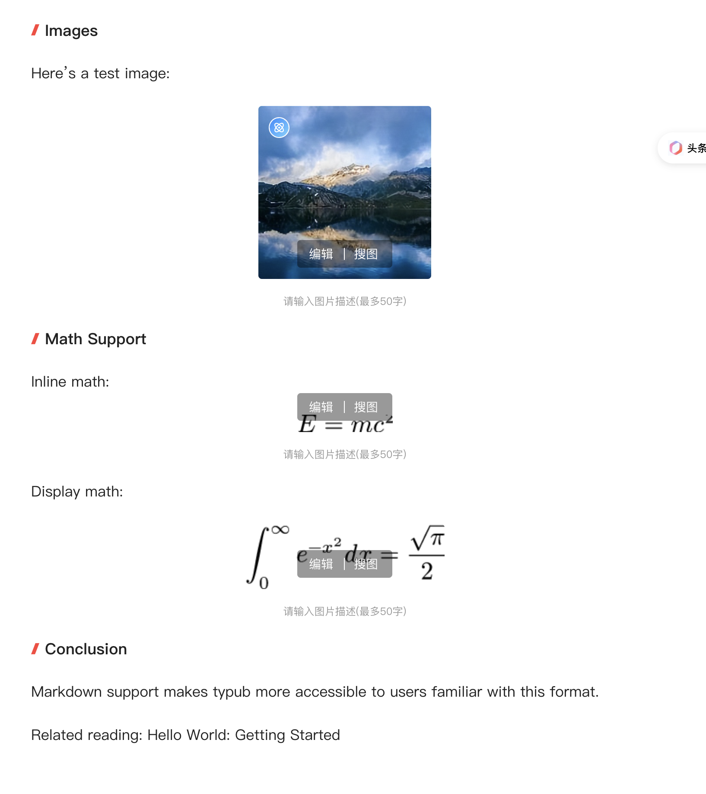

# 今日头条

今日头条是字节跳动旗下的内容分发平台，支持图文、视频等多种内容形式。

## 平台能力

| 特性     | 支持情况        |
| -------- | --------------- |
| 输出格式 | HTML（富文本）  |
| 代码高亮 | 支持            |
| 资源策略 | embed（Base64） |
| 数学公式 | 支持（PNG渲染） |

### 资源策略

| 策略       | 支持 | 默认 | 说明           |
| ---------- | ---- | ---- | -------------- |
| `embed`    | 是   | \*   | Base64内嵌图片 |
| `external` | 是   |      | 使用S3/R2外链  |

## 使用方法

今日头条使用复制粘贴工作流：

```bash
# 预览内容
typub dev posts/my-post -p toutiao
```

1. 浏览器打开预览页面
2. 点击 **复制内容** 按钮
3. 打开 [头条号创作](https://mp.toutiao.com/profile_v4/graphic/publish)
4. 粘贴内容到编辑器



## 平台限制

### 数学公式

- **支持方式**：通过 PNG 图片渲染数学公式
- **Inline 公式限制**：粘贴后会被自动转换为 Block（独立段落）格式
- **建议**：如果文章包含大量数学公式，建议在粘贴后检查排版

### 链接过滤

- **外部链接**：头条会自动过滤（移除）文档中的链接
- **影响范围**：所有 `<a href="...">` 标签都会被移除
- **建议**：如有重要链接，可在文末以纯文本形式列出

## 平台注意事项

- **图片处理**：头条会自动处理粘贴的Base64图片，上传到其CDN
- **代码块**：支持语法高亮的代码块显示
- **内容审核**：文章发布需要通过平台审核
- **排版建议**：头条读者偏好图文并茂的内容

## 提示

- 标题推荐使用吸引眼球的表达
- 配图建议使用高清大图
- 摘要部分会在列表页展示，需精心撰写
- 可设置封面图，建议尺寸900x500
- 文章分类需要在编辑器中手动选择

## 发布流程

1. 复制粘贴内容后，检查格式
2. **检查链接**：确认重要链接是否被过滤
3. **检查公式**：确认数学公式显示是否正确
4. 设置文章分类
5. 添加封面图（可选）
6. 填写摘要（可选，系统可自动提取）
7. 点击发布，等待审核
