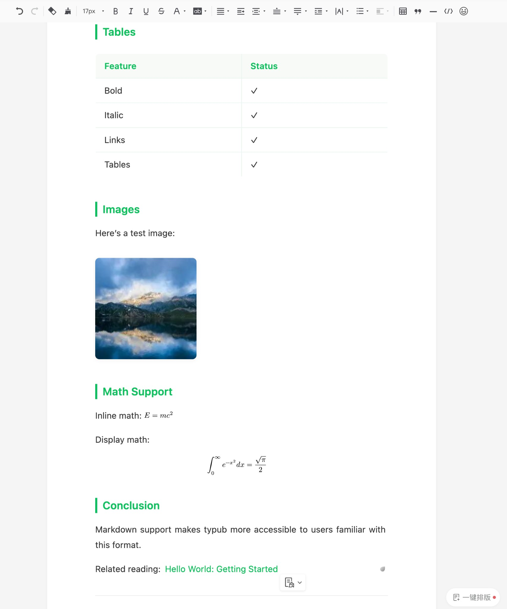

# 微信公众号

微信公众号是中国最大的内容发布平台之一，支持图文、音频、视频等多种内容形式。

## 平台能力

| 特性     | 支持情况                       |
| -------- | ------------------------------ |
| 输出格式 | HTML（富文本）                 |
| 默认主题 | wechat-green                   |
| 特殊转换 | li_span_wrap（列表文字不分行） |

### 资源策略

| 策略                   | 支持 | 默认 |
| ---------------------- | ---- | ---- |
| `embed`（Base64 内嵌） | 是   | \*   |
| `external`（外部存储） | 是   |      |

## 平台限制/注意事项

- **图片**：不支持外链图片，必须使用内嵌或手动上传
- **SVG**：支持内联 SVG，但复杂 SVG 可能渲染异常
- **字体**：仅支持系统默认字体，自定义字体会被忽略
- **CSS**：样式必须内联，不支持外部样式表或 `<style>` 标签
- **列表**：需要特殊处理防止文字分行（typub 已自动处理）
- **代码块**：支持，但语法高亮依赖内联样式

## 发布流程

### 1. 预览内容

```bash
typub dev posts/my-post -p wechat
```

浏览器会自动打开预览页面。


### 2. 复制内容

点击预览页面的 **复制内容** 按钮。

### 3. 打开编辑器

访问 [微信公众号后台](https://mp.weixin.qq.com)，登录后点击 **内容管理** → **草稿箱** → **新建图文**。

### 4. 粘贴内容

1. 在编辑器中点击正文区域
2. 使用 `Ctrl+V`（Windows）或 `Cmd+V`（Mac）粘贴
3. 检查格式是否正确



### 5. 处理图片

如果使用 `asset_strategy = "embed"`，图片已经内嵌，无需额外操作。

如果图片显示为占位符或链接：

1. 点击图片占位符
2. 选择 **上传图片** 或从素材库选择

### 6. 发布

1. 添加标题、摘要、封面图
2. 点击 **发布** 或 **定时发布**

## 配置选项

```toml
[platforms.wechat]
theme = "wechat-green"      # 可选主题：elegant, github, notion
asset_strategy = "embed"    # 推荐使用 embed
```

## 可用主题

| 主题           | 说明                 |
| -------------- | -------------------- |
| `wechat-green` | 微信绿色调，默认主题 |
| `elegant`      | 简约黑白风格         |
| `github`       | GitHub 风格          |
| `notion`       | Notion 风格          |

## 常见问题

### Q: 粘贴后格式丢失？

A: 确保使用预览页面的"复制内容"按钮，而不是直接复制 HTML 文件内容。部分浏览器可能需要授予剪贴板权限。

### Q: 图片显示不出来？

A:

- 检查是否使用了 `asset_strategy = "embed"`
- 如果使用 `external`，需要在微信后台手动上传图片
- 微信不支持外链图片，必须使用内嵌或上传

### Q: 代码块样式不正确？

A: typub 使用内联样式来保持代码块格式。如果样式异常，尝试切换主题：

```toml
[platforms.wechat]
theme = "github"  # 使用 GitHub 风格
```

### Q: 列表项文字被分成多行？

A: typub 默认启用 `li_span_wrap` 转换规则来防止这个问题。如果仍然出现，请检查是否正确使用了预览功能。
