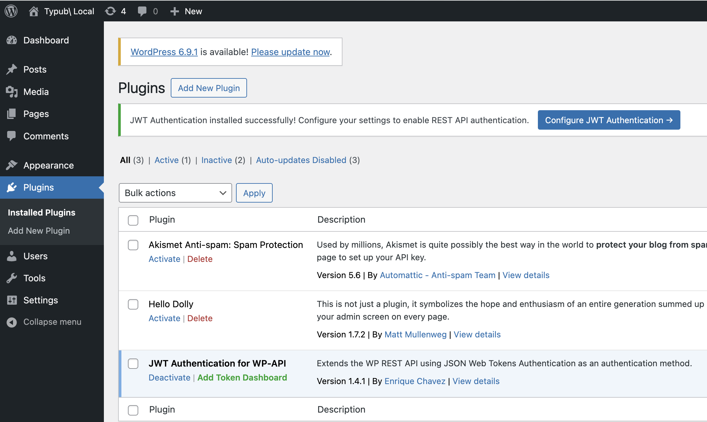

# WordPress

WordPress is the world's most popular content management system, powering over 40% of websites. typub supports publishing to WordPress via the REST API with JWT authentication.

## Capabilities

| Feature        | Support                   |
| -------------- | ------------------------- |
| Tags           | Yes                       |
| Categories     | Yes                       |
| Internal Links | Yes                       |
| Draft Support  | Reversible (status field) |
| Math Rendering | SVG                       |
| Local Output   | No                        |

### Asset Strategies

| Strategy   | Supported | Default | Notes                             |
| ---------- | --------- | ------- | --------------------------------- |
| `embed`    | Yes       |         | Images embedded as data URIs      |
| `upload`   | Yes       | \*      | Upload to WordPress Media Library |
| `external` | Yes       |         | Use S3/R2 URLs                    |
| `copy`     | No        |         | WordPress requires upload or URL  |

## Prerequisites

- A self-hosted WordPress site (WordPress.com is **not** supported)
- Administrator access to install plugins
- JWT Authentication plugin installed and configured

## Setting Up JWT Authentication

WordPress REST API requires authentication for content creation. The recommended method is JWT (JSON Web Token) authentication.

### Step 1: Install JWT Authentication Plugin

**Option A: Via WordPress Admin (GUI)**

1. Log in to your WordPress admin panel
2. Go to **Plugins** → **Add New**
3. Search for "JWT Authentication for WP REST API"
4. Install and activate the plugin



**Option B: Via WP-CLI (Command Line)**

If you have WP-CLI available (common in Docker setups):

```bash
wp plugin install jwt-authentication-for-wp-rest-api --activate
```

### Step 2: Configure JWT Plugin (If Needed)

> **Note**: Some hosting providers or Docker images may have this pre-configured. If the plugin works without manual configuration, you can skip this step.

The JWT plugin may require configuration in your `wp-config.php` file:

```php
// Add these lines to wp-config.php (before "/* That's all, stop editing! */")

define('JWT_AUTH_SECRET_KEY', 'your-secret-key-here');
define('JWT_AUTH_CORS_ENABLE', true);
```

> **Security Note**: Generate a strong secret key. You can use [WordPress Salt Generator](https://api.wordpress.org/secret-key/1.1/salt/) or any secure random string (64+ characters).

#### Docker Deployment

For Docker-based WordPress installations, you can set the secret key via environment variables:

```yaml
# docker-compose.yml
services:
  wordpress:
    image: wordpress:latest
    environment:
      WORDPRESS_DB_HOST: db
      WORDPRESS_DB_USER: exampleuser
      WORDPRESS_DB_PASSWORD: examplepass
      WORDPRESS_DB_NAME: exampledb
      # Add JWT secret key
      WORDPRESS_CONFIG_EXTRA: |
        define('JWT_AUTH_SECRET_KEY', 'your-strong-secret-key-here');
        define('JWT_AUTH_CORS_ENABLE', true);
```

Or mount a custom `wp-config.php` with the JWT constants already defined.

#### Shared Hosting

On shared hosting, you may also need to enable HTTP Authorization headers in `.htaccess`:

```apache
RewriteEngine on
RewriteCond %{HTTP:Authorization} ^(.*)
RewriteRule ^(.*) - [E=HTTP_AUTHORIZATION:%1]
```

### Step 3: Generate JWT Token

WordPress does not provide a UI for generating JWT tokens. You need to make an API request:

```bash
curl -X POST "https://your-site.com/wp-json/jwt-auth/v1/token" \
  -H "Content-Type: application/json" \
  -d '{"username": "your-username", "password": "your-password"}'
```

The response will contain your JWT token:

```json
{
  "token": "eyJ0eXAiOiJKV1QiLCJhbGciOiJIUzI1NiJ9...",
  "user_email": "you@example.com",
  "user_nicename": "your-username",
  "user_display_name": "Your Name"
}
```

> **Important**: Copy the `token` value. This is your API key for typub.

### Step 4: Verify Token Works

Test your token:

```bash
curl -X GET "https://your-site.com/wp-json/wp/v2/users/me" \
  -H "Authorization: Bearer YOUR_TOKEN_HERE"
```

If successful, you'll see your user profile data.

## Configuration

```toml
[platforms.wordpress]
base_url = "https://your-site.com"  # Your WordPress site URL (required)
api_key = "your-jwt-token"           # JWT token (or use WORDPRESS_API_KEY env var)
asset_strategy = "upload"            # Default: upload to Media Library
published = true                      # true for published, false for draft
```

**Environment Variables**:

Set `WORDPRESS_API_KEY` with your JWT token:

```bash
export WORDPRESS_API_KEY="eyJ0eXAiOiJKV1QiLCJhbGciOiJIUzI1NiJ9..."
```

Or in your shell profile:

```bash
# ~/.bashrc or ~/.zshrc
export WORDPRESS_API_KEY="eyJ0eXAiOiJKV1QiLCJhbGciOiJIUzI1NiJ9..."
```

> **Security Warning**:
>
> - **Never commit JWT tokens to version control** — use environment variables instead.
> - JWT tokens are long-lived. If compromised, regenerate by changing your WordPress password and creating a new token.
> - Store the token securely; it provides full write access to your WordPress site.

## Usage

```bash
# Preview content
typub dev posts/my-post -p wordpress

# Publish to WordPress
typub publish posts/my-post -p wordpress
```

## Taxonomy Sync

WordPress supports both **tags** and **categories**, which typub will automatically sync:

- Tags in your post's front matter are synced to WordPress tags
- Categories in your post's front matter are synced to WordPress categories
- If a tag or category doesn't exist, it will be created automatically

```toml
# In your post's meta.toml
tags = ["wordpress", "tutorial", "cms"]
categories = ["Web Development", "Tutorials"]
```

## Asset Handling

### Upload Strategy (Default)

With `asset_strategy = "upload"`, images are uploaded to your WordPress Media Library:

1. typub uploads each image via the WordPress REST API
2. Images appear in your Media Library
3. Posts reference the uploaded image URLs

### External Strategy

With `asset_strategy = "external"`, use S3/R2 storage:

```toml
[storage]
type = "s3"
endpoint = "https://your-r2-endpoint.r2.cloudflarestorage.com"
bucket = "your-bucket"
region = "auto"
public_url_prefix = "https://cdn.your-domain.com"

[platforms.wordpress]
asset_strategy = "external"
```

### Embed Strategy

With `asset_strategy = "embed"`, images are embedded as Base64 data URIs. This is not recommended for large images due to size limitations.

## Troubleshooting

### "Unauthorized" error

- Verify your JWT token is correct and not expired
- Ensure `WORDPRESS_API_KEY` environment variable is set
- Check that JWT plugin is properly configured
- Try regenerating your token

### "JWT not valid" error

- The token may have expired or been invalidated
- Regenerate by creating a new token via the API
- Check that `JWT_AUTH_SECRET_KEY` is consistently configured

### "Rest cannot access" error

- Ensure the user has sufficient permissions (Editor or Administrator role)
- Check that REST API is enabled on your WordPress site
- Verify no security plugins are blocking REST API access

### Images not uploading

- Check your PHP upload limits in `php.ini` (`upload_max_filesize`, `post_max_size`)
- Ensure the user has upload permissions
- Try using `asset_strategy = "external"` with S3/R2 storage

### Posts not updating

- typub finds existing posts by slug
- If you changed the slug, the old post won't be found
- Use the WordPress post ID in your local status database to force updates

### CORS errors

- Ensure `JWT_AUTH_CORS_ENABLE` is set to `true`
- Check your server's CORS headers configuration
