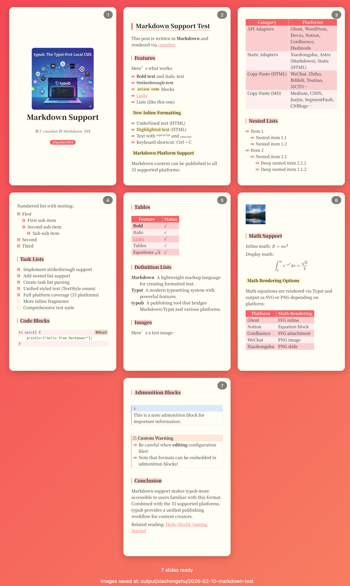

# 小红书 (Xiaohongshu)

小红书是中国流行的生活方式分享平台，以图文笔记和短视频为主。typub 支持将内容转换为幻灯片图片，供手动上传到小红书。

## 平台特点

小红书没有开放 API，因此 typub 采用**图片生成 + 手动上传**的方式：

1. typub 将你的文章内容转换为精美的幻灯片图片
2. 图片保存到本地输出目录
3. 你手动在小红书 App 中上传这些图片

## Capabilities

| Feature        | Support                      |
| -------------- | ---------------------------- |
| Tags           | No（需手动添加）             |
| Categories     | No                           |
| Internal Links | No（不支持外链）             |
| Draft Support  | None（本地输出，无草稿概念） |
| Math Rendering | SVG / PNG                    |
| Local Output   | Yes                          |

### Asset Strategies

| Strategy   | Supported | Default | Notes                 |
| ---------- | --------- | ------- | --------------------- |
| `embed`    | Yes       | \*      | 图片内嵌到幻灯片中    |
| `upload`   | No        |         | 小红书不支持 API 上传 |
| `external` | No        |         | 小红书不支持外链图片  |
| `copy`     | No        |         | 不适用                |

## Prerequisites

- [Typst](https://typst.app/) 已安装（用于渲染幻灯片）
- 小红书 App（用于手动上传）

## Configuration

```toml
[platforms.xiaohongshu]
output_dir = "output/xiaohongshu"  # 幻灯片输出目录
```

## Content Format

小红书适配器将你的文章内容（Typst 或 Markdown）渲染为精美的幻灯片图片。

### 内容文件

typub 会自动检测以下内容文件（按优先级）：

- `content.typ` — Typst 格式
- `content.md` — Markdown 格式

### 可选的 slides.typ

如果你有现成的 Typst 幻灯片文件 `slides.typ`，typub 也会检测到它。但通常 typub 会自动将 `content.typ` 或 `content.md` 转换为幻灯片格式。

### 元数据配置

在 `meta.toml` 中可以设置以下小红书专属字段：

```toml
[platforms.xiaohongshu]
subtitle = "副标题（可选）"
author = "@你的用户名"
```

### 文章结构建议

小红书内容以图文为主，建议：

- 使用一级标题（`= Title`）分隔不同幻灯片/页面
- 每个段落简洁明了
- 图片会自动嵌入幻灯片

## Usage

预览：

```bash
typub dev posts/my-post -p xiaohongshu
```



“发布”：

```bash
typub publish posts/my-post -p xiaohongshu
```

生成完成后，幻灯片图片会保存在 `{platforms.xiaohongshu.output_dir}/{slug}/` 目录下。

## Publishing to 小红书

### Step 1: 生成幻灯片

```bash
typub publish posts/my-post -p xiaohongshu
```

终端会显示：

```
Generated 5 slides at: output/xiaohongshu/my-post
Upload these images manually to 小红书
```

### Step 2: 打开小红书 App

1. 打开小红书 App
2. 点击底部的 **+** 按钮
3. 选择 **图文**

### Step 3: 上传图片

1. 点击 **相册**
2. 选择生成的幻灯片图片（按顺序选择）
3. 点击 **下一步**

### Step 4: 添加标题和标签

1. 输入标题（建议与文章标题一致）
2. 添加话题标签
3. 编写简介（可选）
4. 点击 **发布**

## Best Practices

### 标题建议

小红书标题建议：

- 控制在 20 字以内
- 使用吸引眼球的表达
- 可以使用 emoji

### 内容长度

每张幻灯片建议：

- 文字不超过 100 字
- 重点突出，便于快速阅读
- 适合手机竖屏浏览

### 图片数量

小红书图文笔记：

- 最多可上传 18 张图片
- 建议控制在 5-10 张
- 第一张图最重要（封面）

## Troubleshooting

### "No slide images generated" 错误

- 确保已安装 Typst：`typst --version`
- 确保目录中有 `content.typ` 或 `content.md` 文件
- 如果问题仍然存在，尝试手动运行 `typst compile` 查看错误

### Typst 渲染失败

- 检查 Typst 版本是否最新
- 确保内容语法正确
- 查看 typub 的错误输出

### 图片显示不正确

- 确保图片路径正确
- 图片格式应为 PNG 或 JPG
- 检查图片尺寸是否合适

### 幻灯片数量过多

- 调整文章结构，合并内容
- 减少一级标题数量
- 考虑拆分为多篇文章

## Character Limits

小红书内容限制：

| 项目     | 限制          |
| -------- | ------------- |
| 标题     | 20 字（推荐） |
| 正文     | 1000 字       |
| 图片数量 | 最多 18 张    |
| 话题标签 | 最多 5 个     |

> **Note**: 这些是小红书平台的限制，typub 不会强制检查。请在上传前自行控制内容长度。
