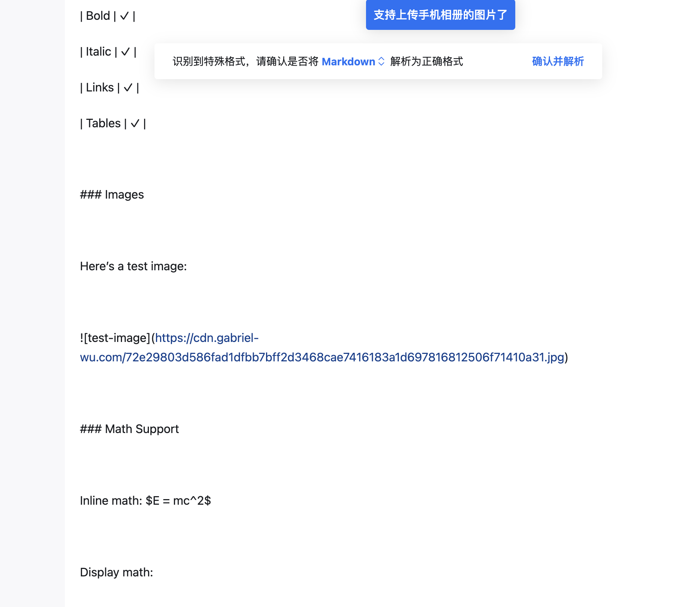
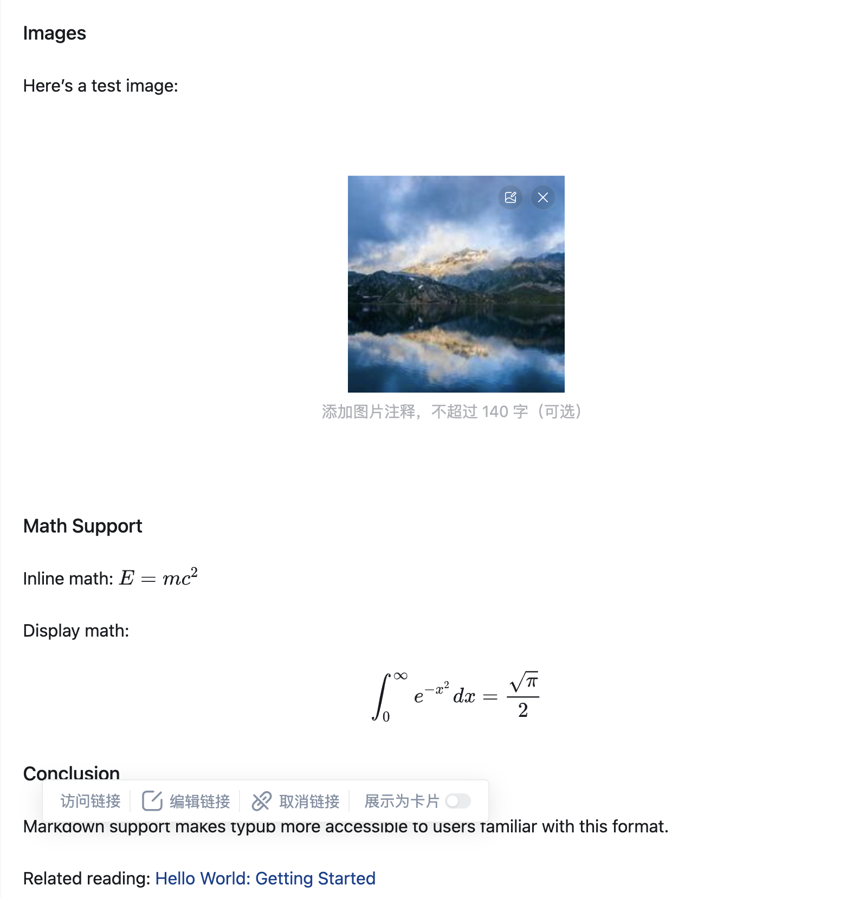

# 知乎

知乎是中国最大的知识分享平台，支持专栏文章和回答。

## 平台能力

| 特性     | 支持情况                 |
| -------- | ------------------------ |
| 输出格式 | Markdown（导入到编辑器） |
| 默认主题 | elegant                  |
| 特殊转换 | 无                       |

### 资源策略

| 策略                   | 支持 | 默认 |
| ---------------------- | ---- | ---- |
| `embed`（Base64 内嵌） | 否   |      |
| `external`（外部存储） | 是   | \*   |

## 平台限制/注意事项

- **图片**：不支持外链图片，需要上传到知乎图床
- **SVG**：不支持 SVG，会被忽略或显示异常
- **图片格式**：不支持内嵌图片（Base64），必须使用外部存储并手动上传
- **字体**：仅支持系统字体
- **CSS**：样式会被过滤，仅保留基础格式
- **代码块**：支持，但目前语言无法自动识别，需手动选择

## 发布流程

### 1. 预览内容

```bash
typub dev posts/my-post -p zhihu
```

浏览器会自动打开预览页面。

### 2. 复制内容

点击预览页面的 **复制内容** 按钮。

### 3. 打开编辑器

访问 [知乎专栏写文章](https://zhuanlan.zhihu.com/write)。

### 4. 导入 Markdown

1. 在编辑器正文区域粘贴（`Ctrl+V` 或 `Cmd+V`）
2. 知乎会识别 Markdown 格式并提示"识别到特殊格式，请确认是否将 Markdown 解析为正确格式"
3. 点击 **确认并解析**



4. 内容将被转换为富文本格式，包括图片、公式等



### 5. 处理图片

由于知乎不支持内嵌图片，需要手动上传：

1. 对于每个图片占位符，点击并选择 **上传图片**
2. 选择对应的本地图片文件
3. 或者使用 `asset_strategy = "external"`（默认），先上传到 S3/R2，再复制链接

**推荐做法**：使用 `external` 策略（默认），先运行 `typub publish` 上传图片，然后在知乎中使用图片链接。

### 6. 发布

1. 添加标题
2. 选择话题标签
3. 点击 **发布**

## 配置选项

```toml
[platforms.zhihu]
theme = "elegant"           # 可选主题
asset_strategy = "external" # 默认值
```

## 推荐配置

由于知乎不支持内嵌图片，建议配置外部存储：

```toml
[storage]
type = "s3"
endpoint = "https://your-r2-endpoint.r2.cloudflarestorage.com"
bucket = "your-bucket"
region = "auto"
public_url_prefix = "https://cdn.your-domain.com"

[platforms.zhihu]
asset_strategy = "external"
```

## 常见问题

### Q: 图片显示为空白或占位符？

A: 知乎不支持内嵌图片。解决方案：

1. 配置外部存储（S3/R2）
2. 设置 `asset_strategy = "external"`（默认值）
3. 运行 `typub dev` 上传图片
4. 预览页面会显示实际图片 URL

### Q: 数学公式不显示？

A: typub 会将公式转换为 LaTeX 格式（`$...$` 和 `$$...$$`），知乎编辑器会自动渲染。如果公式未正确显示，请检查 LaTeX 语法是否正确。

### Q: 样式与预览不一致？

A: 知乎会过滤大部分自定义样式。预览页面的效果仅供参考，实际显示以知乎为准。

### Q: 代码块没有语法高亮？

A: 目前 typub 导出的代码块在知乎无法正确识别语言，需要在粘贴后手动选择代码语言。这是一个已知问题，未来版本会修复。
